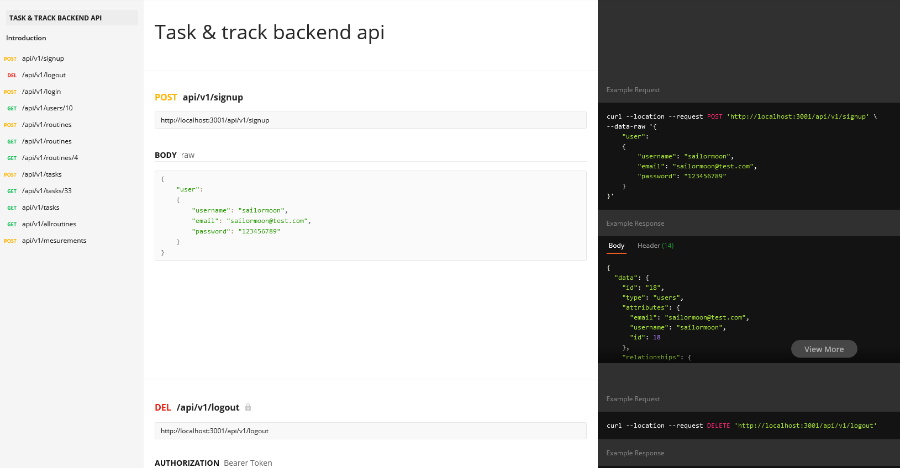
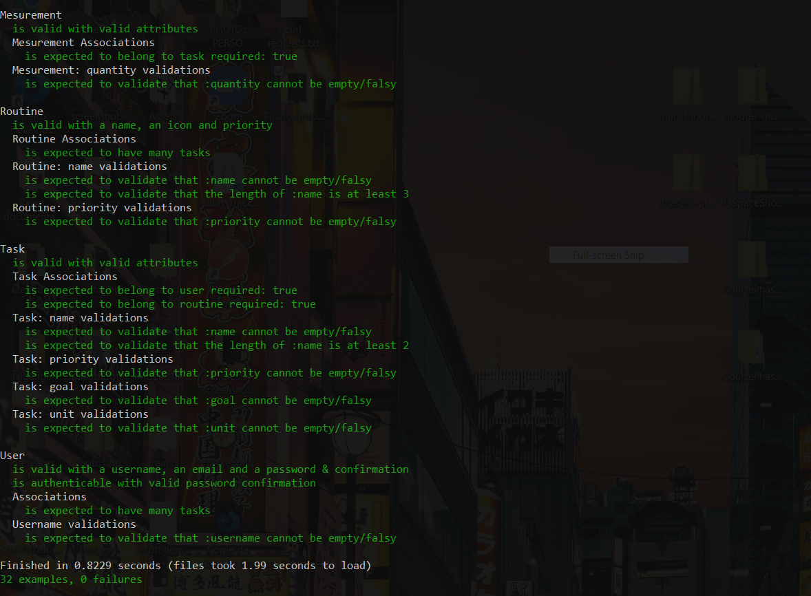
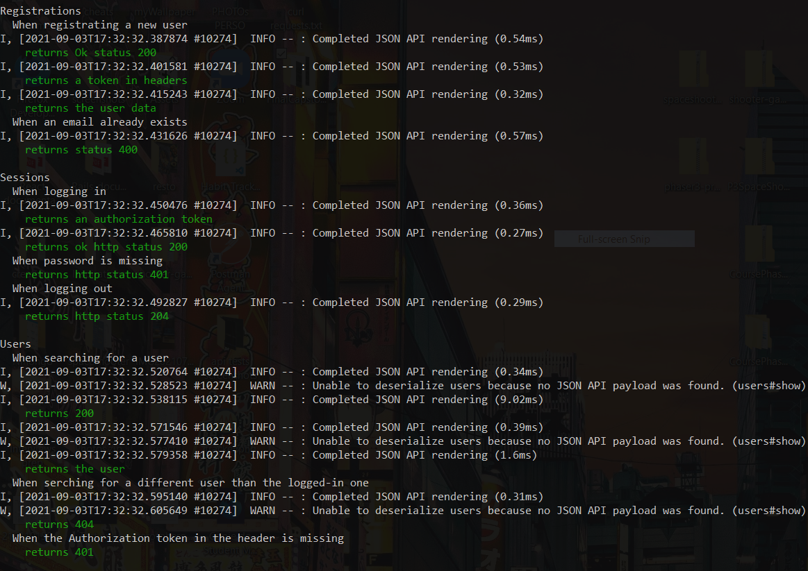

# Task & Track | Backend API
## About the project
In this project, I built the back-end side of a tracking application that allows you to track your daily tasks.
This project was built following the specifications and user stories given here:
[Click here to read the projects specifications](https://www.notion.so/Final-Capstone-Project-Tracking-App-22e454da738c46efaf17721826841772)

## Built with
  <a href="https://www.ruby-lang.org/en/documentation/"></a>
  <a href="https://guides.rubyonrails.org/"></a>
  <a href="https://www.postgresql.org/"></a>
  <a href="#"></a>
  <a href="https://github.com/"></a>
  <br>

## Table of content
- [About the project](#about-the-project)
- [Built with](#built-with)
- [API documentation](#api-documentation)
- [API Endpoints](#api-endpoints)
- [Link to the deployed API](#link-to-the-deployed-api)
- [Walkthrough Video presentation](#walkthrough-video-presentation)
- [Front-end side](#front-end-side)
- [Dependencies](#dependencies)
- [Linting tools](#linting-tools)
- [Getting started](#getting-started-in-development)
- [Automated tests](#automated-tests)
- [Author](#author)
- [Contributing](#-Contributing)
- [Acknowledgments](#acknowledgments)
- [License](#license)

## API documentation
[Full documentaion for this API here!](https://documenter.getpostman.com/view/16917110/U16ewTvn)

<br>

<br>

## API Endpoints
This API provides the following Endpoints:
<table>
  <tr>
    <th>RESTful Endpoint</th>
    <th>Description</th>
  </tr>
  <tr>
    <td>POST /api/v1/signup</td>
    <td>Signup of a new user</td>
  </tr>
  <tr>
    <td>POST /api/v1/login</td>
    <td>Login a registred user</td>
  </tr>
  <tr>
    <td>DELETE /api/v1/logout</td>
    <td>Logout a logged in user</td>
  </tr>
  <tr>
    <td>GET /api/v1/users/:id</td>
    <td>Get a user profile</td>
  </tr>
  <tr>
    <td>POST /api/v1/routines</td>
    <td>Greate a new routine</td>
  </tr>
  <tr>
    <td>GET /api/v1/routines/:id</td>
    <td>Get a routine's details</td>
  </tr>
  <tr>
    <td>GET /api/v1/allroutines</td>
    <td>Get all routines names to be selected for the creation of a task</td>
  </tr>
  <tr>
    <td>DELETE /api/v1/routines/:id</td>
    <td>Destroy a routine</td>
  </tr>
  <tr>
    <td>GET api/v1/tasks</td>
    <td>List of all user's tasks</td>
  </tr>
  <tr>
    <td>POST /api/v1/tasks</td>
    <td>Create new task</td>
  </tr>
  <tr>
    <td>GET /api/v1/tasks/:id</td>
    <td>Provides task details</td>
  </tr>
  <tr>
    <td>DELETE /api/v1/tasks/:id</td>
    <td>Destroy task</td>
  </tr>
  <tr>
    <td>GET /api/v1/alltasks</td>
    <td>Get all tasks names to be selected for the creation of a measurement</td>
  </tr>
  <tr>
    <td>POST /api/v1/mesurements</td>
    <td>Create new mesurement</td>
  </tr>
</table>


## Link to the deployed API
[Link to the deployed Api on Heroku](https://task-n-track.herokuapp.com/)

## Walkthrough video presentation
[Check here a video presentation of the project]()

## Front-end side

- [Check the GitHub repository of the front-end side of the project here!](https://github.com/CalyCherkaoui/task-track-front-end)
- [Check the deployed version of the front-end side of the project here!](https://github.com/CalyCherkaoui/task-track-front-end)

## Dependencies
The main dependencies used in this web application:

<table>
  <tr>
    <th>Dependency</th>
    <th>for</th>
    <th>Development</th>
    <th>Test</th>
    <th>Production</th>
  </tr>
  <tr>
    <td>Rails</td>
    <td>Ruby based server-side web application framework</td>
    <td>⭐️</td>
    <td>⭐️</td>
    <td>⭐️</td>
  </tr>
  <tr>
    <td>Postgresql</td>
    <td>Database</td>
    <td>⭐️</td>
    <td>⭐️</td>
    <td>⭐️</td>
  </tr>
  <tr>
    <td>rspec-rails</td>
    <td>A testing framework for Rails</td>
    <td></td>
    <td>⭐️</td>
    <td></td>
  </tr>
  <tr>
    <td>factory_bot_rails</td>
    <td>A fixtures replacement</td>
    <td></td>
    <td>⭐️</td>
    <td></td>
  </tr>
  <tr>
    <td>shoulda-matchers</td>
    <td>Simple One-Liner Tests for Rails</td>
    <td></td>
    <td>⭐️</td>
    <td></td>
  </tr>
  <tr>
    <td>database_cleaner</td>
    <td>Strategies for cleaning databases in testing</td>
    <td></td>
    <td>⭐️</td>
    <td></td>
  </tr>
  <tr>
    <td>faker</td>
    <td>Generates fake data for testing</td>
    <td></td>
    <td>⭐️</td>
    <td></td>
  </tr>
  <tr>
    <td>bcrypt</td>
    <td>A secure hash algorithm for hashing passwords</td>
    <td>⭐️</td>
    <td></td>
    <td></td>
  </tr>
  <tr>
    <td>devise</td>
    <td>Flexible authentication solution for Rails based on Warden</td>
    <td>⭐️</td>
    <td>⭐️</td>
    <td>⭐️</td>
  </tr>
  <tr>
    <td>devise-jwt</td>
    <td>Implementation of the RFC 7519 OAuth JSON Web Token standard</td>
    <td>⭐️</td>
    <td></td>
    <td>⭐️</td>
  </tr>
  <tr>
    <td>rack-cors</td>
    <td>Support for Cross-Origin Resource Sharing for Rack compatible web apps</td>
    <td>⭐️</td>
    <td></td>
    <td>⭐️</td>
  </tr>
  <tr>
  <td>Jsonapi-rails</td>
    <td>Rails helper for api resources serialization</td>
    <td>⭐️</td>
    <td></td>
    <td>⭐️</td>
  </tr>
  <td>Cancancan</td>
    <td>Rails helper for authorisation management</td>
    <td>⭐️</td>
    <td></td>
    <td>⭐️</td>
  </tr>
</table>

## Linting tools
<table>
  <tr>
    <th>Linter</th>
    <th>Use</th>
    <th>Files</th>
  </tr>
  <tr>
    <td>Rubocop</td>
    <td>Linting Ruby files</td>
    <td>.rb</td>
  </tr>
</table>

## Getting started in development

### Clone the repository:

To get a local copy of the repository, please run the following commands on your terminal:

```
$ git clone git@github.com:CalyCherkaoui/task-tracker-backend-api.git
$ cd TaskAndTrack-backend-api
$ git branch feature
$ git checkout feature

```

### Prerequisites:

Ruby: 2.6.6
Rails: 6.0.4

Run your Postgresql service in your terminal:

```
$ sudo service postgresql restart
```
### Setup:

Install gem dependencies:
```
$ bundle install
```

Setup the database:
```
$ rails db:create
$ rails db:migrate
$ rails db:seed
```

### Usage:

Run Rails server:
```
$ rails s
```
In the browser, open ``http://localhost:3001``


To lint Ruby code:
```
$  rubocop -A
```

To run the tests:
```
$  bundle exec rpsec
```
## Automated tests

### Unit tests series:

<br>

<br>

### Request tests series:

<br>

<br>

## Author
👤 **Houda Cherkaoui**

- Github: [@CalyCherkaoui](https://github.com/CalyCherkaoui)
- Twitter: [@Houda59579688](https://twitter.com/Houda59579688)
- Linkedin: [Houda-Cherkaoui](https://www.linkedin.com/in/houda-cherkaoui-64106395/)
## Contributing
Contributions, issues, and feature requests are welcome!
## Show your support
Give a ⭐️ if you like this project!
## Acknowledgments
- Hat tip to [stackoverflow](https://stackoverflow.com) comunity.
- Hat tip to [Microverse](https://www.microverse.org/) TSE for Code Review.
- Hat tip to anyone whose code was used
- [deployement tuto](https://mgleon08.github.io/blog/2018/07/22/deploying-rails-nuxt-jwt-to-production-with-heroku/)
## 📝 License
All source code is available jointly under the MIT License.
See [MIT licence](./LICENSE) for details.
